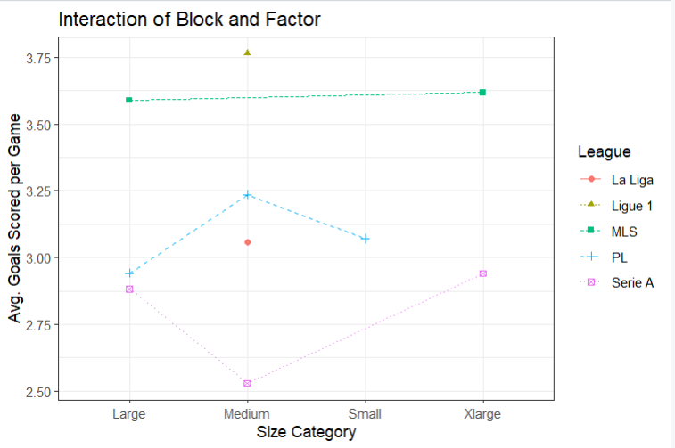
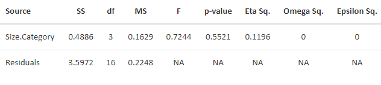

# Soccer Field Size and Goals Scored: ANOVA

A group statistical project asking whether mean home goals per game differ across four soccer field-size categories. We analyzed 20 stadium/team records from the 2023–24 season using a one-way ANOVA in R.

## Result

| Test | Result |
| --- | ---: |
| One-way ANOVA | F(3, 16) = 0.7244 |
| p-value | 0.5521 |
| Eta squared | 0.1196 |

At the 0.05 significance level, this sample does not provide evidence of a difference in mean goals per game among the four field-size categories. This does **not** establish that field size has no effect. The sample is small and observational; league and team differences may confound the comparison.

## Data and method

`data/StadiumGoals_dataset.xlsx` contains 20 populated stadium records, plus blank rows and a category legend. The script excludes rows without games/goals/category, then calculates `goals_per_game = season_goals / Games`. All 20 included rows list 17 games. The spreadsheet has four size labels: Small, Medium, Large and Xlarge. The report describes an initial league-blocked approach, then uses one-way ANOVA because league-by-size coverage is sparse and unbalanced. The included figures show exploratory comparisons and residual diagnostics. Visual diagnostics and a Durbin–Watson statistic alone cannot prove independence; spreadsheet row order is not a time series.

## Run

Install [R](https://www.r-project.org/) and, in R, install the required packages:

```r
install.packages(c("openxlsx", "ggplot2", "car"))
```

From the repository root:

```bash
Rscript analysis.R
```

The script prints the ANOVA table, eta squared and Durbin–Watson statistic, and creates files ending in `_generated.png` in `figures/`. The images ending in `_report.png` were extracted from the submitted PDF; the generated charts use fresh labels and styling. The code is a cleaned, runnable adaptation of the report appendix, preserving its one-way ANOVA and response calculation.

## Files

| Path | Contents |
| --- | --- |
| `analysis.R` | Data loading, ANOVA, diagnostics, and reproducible plot exports |
| `data/StadiumGoals_dataset.xlsx` | Original supplied spreadsheet |
| `figures/*_report.png` | Seven figures extracted from the original report |
| `report/STAT_461_Final_Project_ANOVA.pdf` | Original group report and code appendix |




## Attribution and limitations

Original group report by Vansh Vinod Koul, Nathan Pechulis, Sabeeh Kabir, and Nandagopal Panicker (May 2025). The report and supplied dataset are reproduced here as provided. The underlying season figures and stadium dimensions have not been independently verified; some dimension strings in the spreadsheet are inconsistent, so this project uses the provided size-category labels rather than recalculating field area. Check with the other contributors before publishing jointly authored work or redistributing the spreadsheet publicly.
